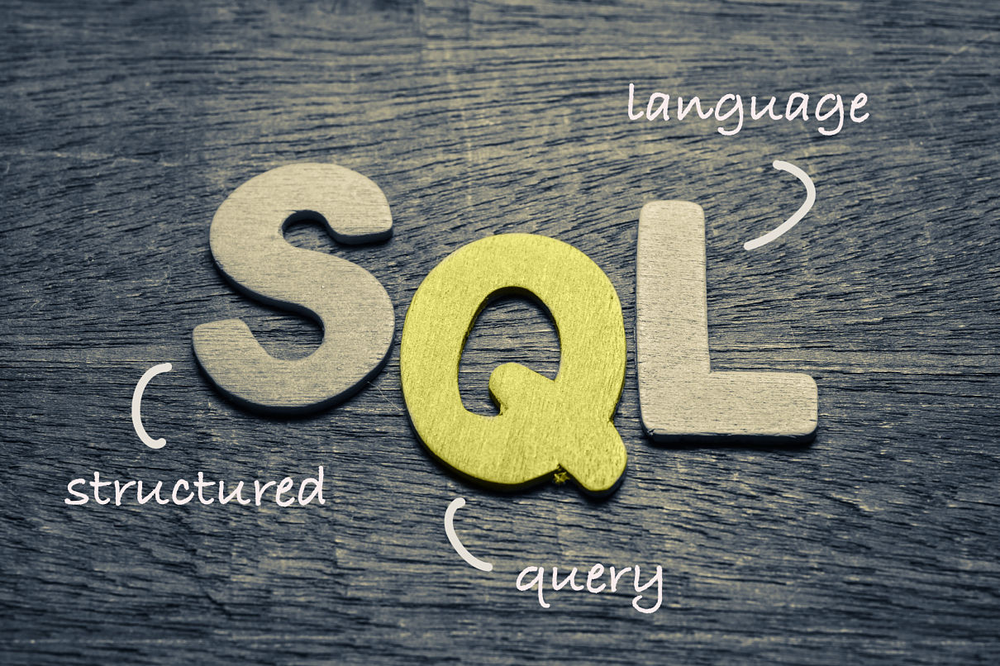

# Qu'est-ce que SQL ?

SQL (Structured Query Language) est un langage utilisé pour interagir avec des bases de données relationnelles. SQL permet de créer, modifier, interroger et gérer les données dans une base de données.

Les bases de données relationnelles organisent les données sous forme de tables composées de lignes (enregistrements) et de colonnes (attributs). SQL vous permet d'effectuer des opérations sur ces données de manière efficace.
Types de commandes SQL
## 1. Commandes DDL (Data Definition Language)

Les commandes DDL sont utilisées pour définir ou modifier la structure des objets dans une base de données.

    CREATE : Crée une nouvelle table, base de données, index, ou autre objet.


__ALTER__ : Modifie une table existante (ajouter une colonne, modifier un type de données, etc.).


__DROP__ : Supprime une table, une colonne ou un autre objet de la base de données.

    DROP TABLE Clients;

## 2. Commandes DML (Data Manipulation Language)

Les commandes DML sont utilisées pour manipuler les données dans une base de données.

__*SELECT*__ : Récupère des données d'une table.
```
SELECT * FROM Clients;
```
__*INSERT*__ : Ajoute une nouvelle ligne dans une table.

    INSERT INTO Clients (client_id, nom, email) VALUES (1, 'Alice', 'alice@email.com');

__*UPDATE*__ : Modifie des données existantes dans une table.

    UPDATE Clients SET email = 'alice@newemail.com' WHERE client_id = 1;

__*DELETE*__ : Supprime des données d'une table.

    DELETE FROM Clients WHERE client_id = 1;

>>>>>>>>><<<<<<<<<<<<<<<<<<<<<<<<<<<<<<<<<<<<<<<<<<<>>>>>>>>>>>>>>>>>>>>>>>>>>>>>>>>>>>>>>>>>>>

### 1. Création d'une base de données


Crée une nouvelle base de données avec le nom hbtn_0c_0.

IF NOT EXISTS : Assure que la commande ne génère pas d'erreur si la base de données existe déjà.

__*Exemple*__ :
```
CREATE DATABASE IF NOT EXISTS hbtn_0c_0;
```
### 2. Suppression d'une base de données

Cette commande supprime la base de données hbtn_0c_0.
Attention : __Toutes les données dans la base de données seront perdues.__

__*Exemple*__ :
```
DROP DATABASE hbtn_0c_0;
```

### 3. Afficher les bases de données existantes
Commande :

```
SHOW DATABASES;
```

Cette commande liste toutes les bases de données présentes dans le serveur MySQL.

__*Exemple de sortie*__ :

+--------------------+
| Database           |
+--------------------+
| information_schema |
| mysql              |
| performance_schema |
| sys                |
| hbtn_0c_0          |
+--------------------+

### 4. Sélectionner une base de données


Cette commande sélectionne une base de données spécifique pour l'utiliser dans les prochaines opérations (insertion, modification, etc.).

__*Exemple*__ :

```
USE hbtn_0c_0;
```
Cela permet de commencer à interagir avec la base hbtn_0c_0.

>>>>>>>>><<<<<<<<<<<<<<<<<<<<<<<<<<<<<<<<<<<<<<<<<<<>>>>>>>>>>>>>>>>>>>>>>>>>>>>>>>>>>>>>>>>>>><<<<<<<<<>>>>>>>>>
## *Données relationnelles*

###  1. Bases de données relationnelles

Une base de données relationnelle est une collection organisée de données structurées sous forme de tables, où chaque table est composée de lignes (enregistrements) et colonnes (attributs). Les bases de données relationnelles utilisent des clés primaires et des clés étrangères pour établir des relations entre les tables.
Exemple d'une base de données :

Une table students pourrait contenir les colonnes suivantes :

    id (clé primaire)
    name
    score

### 2. Commandes SQL courantes
#### 2.1. Sélectionner des données avec SELECT

La commande SELECT permet de récupérer des données d'une table.

__*Exemple*__ : fichier .SQL 
```
SELECT id, name, score
FROM students;
```
Cela récupère toutes les colonnes de la table students.

#### 2.2. Insérer des données avec INSERT INTO

La commande INSERT INTO permet d'ajouter des enregistrements dans une table.

__*Exemple*__ :
```
INSERT INTO students (id, name, score)
VALUES (1, 'Alice', 8);
```
Cela ajoute un nouvel enregistrement avec id=1, name='Alice', et score=8.

#### 2.3. Supprimer des données avec DELETE

La commande DELETE permet de supprimer des lignes d'une table.

__*Exemple*__ :
```
DELETE FROM students
WHERE id = 1;
```
Cela supprime l'enregistrement dont l'id est égal à 1.

#### 2.4. Mettre à jour des données avec UPDATE

La commande UPDATE permet de modifier des données existantes dans une table.

__*Exemple*__ :
```
UPDATE students
SET score = 10
WHERE name = 'Alice';
```
Cela met à jour le score d'Alice à 10.

#### 2.5. Trier les résultats avec ORDER BY

Tu peux trier les résultats d'une requête avec ORDER BY.

__*Exemple*__ :
```
SELECT name, score
FROM students
ORDER BY score DESC;
```
Cela trie les résultats par score en ordre décroissant.

#### 2.6. Calculer des moyennes avec AVG()

La fonction AVG() permet de calculer la moyenne des valeurs d'une colonne.

__*Exemple*__ :
```
SELECT AVG(score) AS average_score
FROM students;
```
Cela calcule la moyenne des scores des étudiants.

#### 2.7. Compter les occurrences avec COUNT()

La fonction COUNT() permet de compter le nombre d'enregistrements qui correspondent à une condition.

__*Exemple*__ :
```
SELECT COUNT(*) AS total_students
FROM students;
```
Cela compte le nombre total d'étudiants dans la table.
### 3. Exemples pratiques
#### 3.1. Créer et insérer des données dans une table en un seul script

Voici un script complet qui crée une table et insère des données dedans :
```
-- #Créer la table `students`
CREATE TABLE students (
    id INT PRIMARY KEY,
    name VARCHAR(100),
    score INT
);

-- #Insérer des données dans la table
INSERT INTO students (id, name, score)
VALUES (1, 'Alice', 8),
       (2, 'Bob', 12),
       (3, 'Charlie', 5),
       (4, 'David', 15),
       (5, 'Eve', 9);
```
Ce script crée une table students et y insère plusieurs enregistrements.
#### 3.2. Afficher tous les enregistrements triés par score décroissant

Voici une requête qui affiche tous les enregistrements de la table students, triés par score décroissant :
```
SELECT name, score
FROM students
ORDER BY score DESC;
```
#### 3.3. Calculer la moyenne des scores

Pour calculer la moyenne des scores des étudiants, tu peux utiliser la fonction AVG() :
```
SELECT AVG(score) AS average_score
FROM students;
```
Cela renverra la moyenne des scores dans la colonne average_score.
#### 3.4. Lister les enregistrements où le score est supérieur à 10

Si tu veux lister les enregistrements où le score est supérieur à 10, tu peux utiliser la condition __WHERE__ :
```
SELECT name, score
FROM students
WHERE score > 10;
```
#### 3.5. Lister les enregistrements d'une table sans afficher les noms vides

Si tu veux lister les enregistrements où le champ name n'est pas vide, tu peux utiliser WHERE pour filtrer les NULL et les chaînes vides :
```
SELECT score, name
FROM second_table
WHERE name IS NOT NULL AND name != ''
ORDER BY score DESC;
```
Cette requête récupère score et name de la table second_table, trie par score de manière décroissante, et exclut les lignes où le name est vide ou NULL.
### 4. Exécuter des requêtes dans MySQL

Pour exécuter un fichier SQL dans MySQL, tu peux utiliser la commande suivante dans le terminal :
```
cat script.sql | mysql -hlocalhost -uroot -p hbtn_0c_0
```
Explication de la commande :

__*cat script.sql*__ : Lit le contenu du fichier script.sql.

__*mysql*__ -hlocalhost -uroot -p hbtn_0c_0* : Connecte à MySQL avec l'utilisateur root et à la base de données hbtn_0c_0.

__*-p*__ : Demande le mot de passe de l'utilisateur root.

### 5. Conclusion

Ce document couvre les commandes SQL de base nécessaires pour interagir avec une base de données MySQL. En utilisant des commandes comme SELECT, INSERT, UPDATE, DELETE, et les fonctions d'agrégation comme COUNT() et AVG(), tu peux manipuler des données de manière efficace.


# Concepts Clés

    Table : Une structure de données composée de lignes et de colonnes.
    Clé primaire : Une colonne ou un ensemble de colonnes dont les valeurs identifient de manière unique chaque ligne d'une table.
    Clé étrangère : Une colonne dans une table qui fait référence à la clé primaire d'une autre table, permettant ainsi de lier les deux tables.
    Requête : Une instruction SQL pour interroger ou manipuler les données.


Conclusion

SQL est un langage puissant pour manipuler et interroger les données dans des bases de données relationnelles. Il permet de gérer les données efficacement, tout en garantissant l'intégrité des données grâce aux concepts de tables, clés primaires et étrangères. Les commandes SQL peuvent être utilisées pour créer des structures de données, interroger des informations, et contrôler l'accès aux données.
