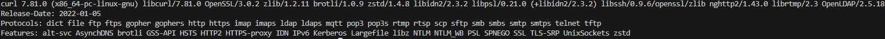

# Guide sur cURL

## Introduction
__cURL__ (Client URL) est un outil de ligne de commande qui permet aux utilisateurs de transférer des données vers ou depuis un serveur réseau, en utilisant l'un des protocoles pris en charge (HTTP, HTTPS, FTP, et plus). Il est largement utilisé pour le débogage, le test et l'interaction avec les services web et les API RESTful.

## Objectif

* __Installer et utiliser__ cURL à partir de la ligne de commande.
* __Construire et exécuter__ des requêtes API de base en utilisant la boucle, y compris le réglage des en-têtes et l'inspection de la sortie.
* __Interpréter__ les résultats des requêtes API communes.


### 1.Installation et interaction de base avec curl:

* *__Installation__* :

Si vous utilisez une distribution basée sur Debian comme Ubuntu, vous pouvez installer cURL avec la commande suivante :

```
sudo apt update
sudo apt install curl
```

* *__Vérifier l’installation__* :

Une fois installé, lancez la commande suivante pour vérifier la version de curl :
```
curl --version
```

Cela affichera des informations sur la version de curl installée, ainsi que les protocoles supportés.

#### _Exemple de rendu_ :



* *__Interaction basique avec une page web__*  :

Utilisez cURL pour récupérer le contenu d’une page web. Par exemple, pour obtenir le contenu de la page http://example.com, utilisez la commande suivante :
```
curl http://example.com
```

### 2.Récupérer des données depuis une API :

Récupérer des publications depuis JSONPlaceholder :
Utilisez curl pour obtenir des publications depuis l'API JSONPlaceholder. JSONPlaceholder est une API de test qui fournit des données fictives pour simuler des requêtes API :
```
curl https://jsonplaceholder.typicode.com/posts
```
Cela renverra une réponse au format JSON contenant un tableau de publications, chaque publication ayant des attributs comme userId, id, title, et body.

#### Ce que tu vois en réponse :

Voici un exemple de réponse (donnée JSON) :
```
{
  "userId": 10,
  "id": 100,
  "title": "Holberton est Cool",
  "body": "Tu veux rejoindre une école qui te pousse à apprendre, créer et innover ?\n Holberton est fait pour toi ! "
}
```
* __userId__ : Cela correspond à l'identifiant de l'utilisateur qui a créé le post (dans cet exemple, l'utilisateur avec l'ID 10).

* __id__ : C'est l'identifiant unique de ce post spécifique (ici, l'ID du post est 100).

* __title__ : Le titre de la publication. C’est un texte qui décrit le sujet du post (ici : "Holberton est Cool").

* __body__ : Le contenu du post. C'est un texte plus long qui représente le message ou le contenu de la publication (ici, il y a une description avec plusieurs lignes).

### Conseils :

* L’option -I dans curl permet de récupérer uniquement les en-têtes de la réponse, ce qui peut être utile pour diagnostiquer des paramètres du serveur (type de contenu, contrôle de cache, etc.).
```
curl -I https://jsonplaceholder.typicode.com/posts
```
* L’option -X vous permet de spécifier une méthode HTTP pour votre requête. Par exemple, -X POST pour faire une requête POST.
```
curl -X POST https://jsonplaceholder.typicode.com/posts 
```
* L’option -d permet de transmettre des données dans votre requête, ce qui est couramment utilisé avec les requêtes POST, PUT ou PATCH pour envoyer des données au serveur.Créer un titre avec le body , l'user et l'Id .

```
curl -X POST -d "title=foo&body=bar&userId=1" https://jsonplaceholder.typicode.com/posts
```

### Easter egg :

* Cette commande renverra l'adresse IP publique de la machine que tu utilises pour exécuter la requête 

```
curl https://httpbin.org/ip
```

* Cette commande te renverra une adresse !Ensuite copier le lien de l'image et l'ouvrir dans un navigateur pour voir un joli chien !

```
curl https://dog.ceo/api/breeds/image/random
```
* Cette commande va afficher la météo de manière un peu stylisée
```
curl -s https://wttr.in/Paris
```
