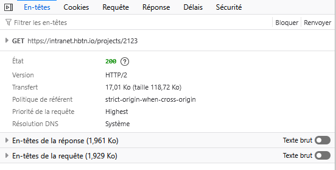
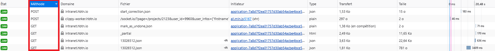

# Guide sur HTTP, HTTPS et Méthodes HTTP
## Introduction
Ce projet explore les concepts clés du protocole HTTP et de sa version sécurisée, HTTPS. Il couvre les différences fondamentales entre HTTP et HTTPS, en mettant l'accent sur les aspects de sécurité, ainsi que sur la structure des requêtes et des réponses HTTP. Vous y trouverez également un aperçu des méthodes HTTP courantes (GET, POST, PUT, DELETE) et des codes de statut associés . L'objectif de ce projet est de fournir une meilleure compréhension de la communication client-serveur via HTTP/HTTPS, et de démontrer comment interagir efficacement avec ces protocoles dans le développement d'applications web.

## Différenciation HTTP et HTTPS:

__HTTP :__ (HyperText Transfer Protocol) : C’est un protocole de communication utilisé pour échanger des informations sur le web. Cependant, HTTP n'est pas sécurisé, ce qui signifie que les données envoyées entre le navigateur et le serveur peuvent être interceptées et lues par des personnes malveillantes.

__HTTPS :__ (HyperText Transfer Protocol Secure) : C'est la version sécurisée de HTTP. HTTPS ajoute un niveau de sécurité en chiffrant les données avec un certificat SSL/TLS. Cela permet de protéger les informations échangées, en assurant leur confidentialité et leur intégrité. HTTPS est particulièrement important pour les sites qui traitent des données sensibles, comme les informations bancaires ou les mots de passe.

## Comprendre la structure HTTP:

Visitez un simple site web, faites un clic droit et choisissez « inspecter » ou « Élément d'inspection ». Naviguez jusqu'à l'onglet « Réseau ». Cela montre toutes les demandes de réseau faites par la page.
Rechargez la page et observez la première demande. Cliquez dessus. Explorer la section « En-tête » pour comprendre la structure des demandes et des réponses HTTP. Vous verrez des méthodes, des chemins, des codes d'état, des en-têtes, et plus encore.

### Exemple et explication : 

#### Dans cet exemple, un navigateur a effectué une requête GET vers https://intranet.hbtn.io/projects/2123

__Type de demande sur la page :__ GET est la méthode HTTP utilisée pour demander une ressource à un serveur

__État 200 :__ Cela signifie que la requête a été réussie.

__Version HTTP/2 :__ Cela indique que le serveur a répondu en utilisant HTTP/2, une version améliorée du protocole HTTP. HTTP/2 améliore la vitesse de transfert en permettant des connexions multiplexées (envoie plusieurs requêtes en même temps)

__Transfert 17,01 Ko (taille 118,72 Ko) :__ Cela indique la quantité de données qui ont été transférées

## Explorer les méthodes de statut HTTP:

#### Vue d'une inspection réseau :

*__Liste de méthodes HTTP Courantes :__*

Les méthodes HTTP permettent de spécifier l’action que le client souhaite effectuer sur une ressource. Voici quatre des méthodes les plus courantes :

1. __GET :__

    Utilisation : Cette méthode est utilisée pour récupérer des données du serveur sans les modifier.
    Exemple : Récupérer une page web ou les informations d'un utilisateur via une API.
    Scénario : Un utilisateur qui charge une page web dans son navigateur.

2. __POST :__

    Utilisation : Cette méthode est utilisée pour envoyer des données au serveur, généralement pour créer une nouvelle ressource.
    Exemple : Soumettre un formulaire d'inscription sur un site web.
    Scénario : Un utilisateur qui envoie un formulaire pour s'inscrire à un service.

3. __PUT :__

    Utilisation : Cette méthode est utilisée pour mettre à jour une ressource existante sur le serveur, en remplaçant la ressource précédente.
    Exemple : Mettre à jour les informations d'un utilisateur dans une base de données.
    Scénario : Un utilisateur qui modifie son profil sur un site web.

4. __DELETE :__

    Utilisation : Cette méthode est utilisée pour supprimer une ressource du serveur.
    Exemple : Supprimer un article de blog ou un utilisateur dans une base de données.
    Scénario : Un administrateur qui supprime un compte utilisateur sur une plateforme.

## Explorer les codes de statut HTTP:

#### Liste des Codes de Statut HTTP Courants :

*__Exemple de status code et fonctions :__*

Les codes de statut HTTP sont des réponses envoyées par le serveur pour indiquer le résultat de la requête effectuée. Voici cinq des codes de statut les plus courants :

1. __200 OK :__

    Description : La requête a été traitée avec succès.
    Scénario : Un utilisateur accède à une page web sans erreur.

2. __404 Not Found :__

    Description : La ressource demandée n'a pas été trouvée sur le serveur.
    Scénario : Un utilisateur tente d'accéder à une page qui n'existe plus ou a été supprimée.

3. __500 Internal Server Error :__

    Description : Une erreur s'est produite sur le serveur, empêchant le traitement de la requête.
    Scénario : Le serveur rencontre un problème lors du traitement d'une demande (par exemple, une erreur dans le code ou une défaillance temporaire).

4. __301 Moved Permanently :__

    Description : La ressource demandée a été déplacée de manière permanente vers une nouvelle URL.
    Scénario : Un site web a changé de domaine ou a déplacé une page vers une autre adresse.

5. __403 Forbidden :__

    Description : L'accès à la ressource est interdit, même si la requête est correcte.
    Scénario : Un utilisateur tente d'accéder à une page ou une ressource à laquelle il n'a pas les permissions nécessaires, comme un fichier protégé par mot de passe.
